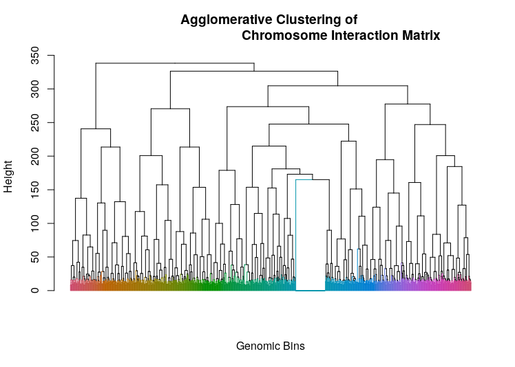

# Three-dimensional Annotation of Motifs into Topologically-associating Domains

<!-- badges: start -->
<!-- badges: end -->

Three-dimensional organization of the chromosome is a factor of gene expression regulation. Visualizations of 3D information is often presented separately from genome/epigenome features and motifs. One existing approach to integrate topological information is simply layering the TADs using GViz/ggbio. While powerful tools to correlate several annotation features, there is no current function to highlight the membership of features and motifs to distinct TADs using GViz/ggbio.

The goal of annotator3D is to annotate motifs into hierarchically clustered TADs. annotator3D does so by:
1. Soft-classifying motifs into TADs by positions (functions found in `classification.R`);
2. Extending GViz with a clusteredAnnotation class to highlight TAD membership (work in progress)


## Installation

You can install the released version of annotator3D with:

``` r
library(devtools)
devtools::install_github("annotator3D")
```

## Example

This is a basic example which shows you how to solve a common problem:

``` r
library(annotator3D)

data(hsa)
data(matchedMotifs)

tads <- cluster(hsa, offset=40000)
```


``` r
tads.cl <- classify(hsa, matchedMotifs, offset=40000)
head(tads.cl)

$H3K9me3_783_cluster_hc1_hc2_0.15_L2
 [1] "116: 0.02"     "114: 0.02"     "109-2-2: 0.04" "121: 0.02"     "122-2-1: 0.02" "131-1-2: 0.02" "137-2-2: 0.02"
 [8] "152-2-2: 0.06" "145: 0.02"     "144-1: 0.02"   "144-2: 0.04"   "140-2: 0.04"   "138-1: 0.02"   "141-1: 0.04"  
[15] "141-2-1: 0.02" "142-1: 0.02"   "143: 0.04"     "70-2: 0.02"    "65-1: 0.02"    "60: 0.02"      "50: 0.02"     
[22] "52: 0.02"      "56: 0.04"      "57: 0.02"      "46-1: 0.04"    "28-2: 0.02"    "22: 0.02"      "23: 0.02"     
[29] "17-1: 0.02"    "24: 0.02"      "10: 0.02"      "9: 0.02"       "12-2: 0.02"    "15: 0.04"      "16: 0.02"     
[36] "6-2-2-1: 0.02" "6-2-2-2: 0.02" "8: 0.02"       "3: 0.02"       "1-1: 0.02"    
```
Each number before the column corresponds to a TAD hierarchical cluster. The number after the colon corresponds to the cluster membership probability of the motif.