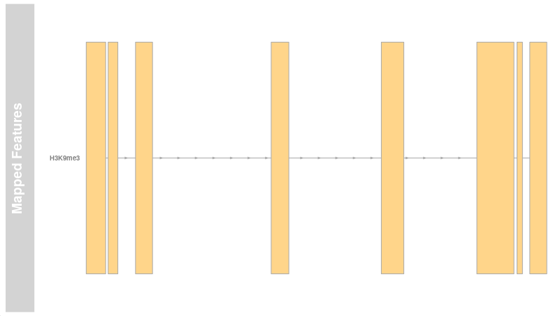
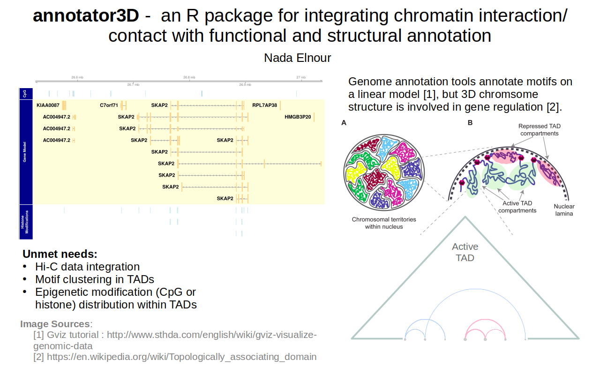
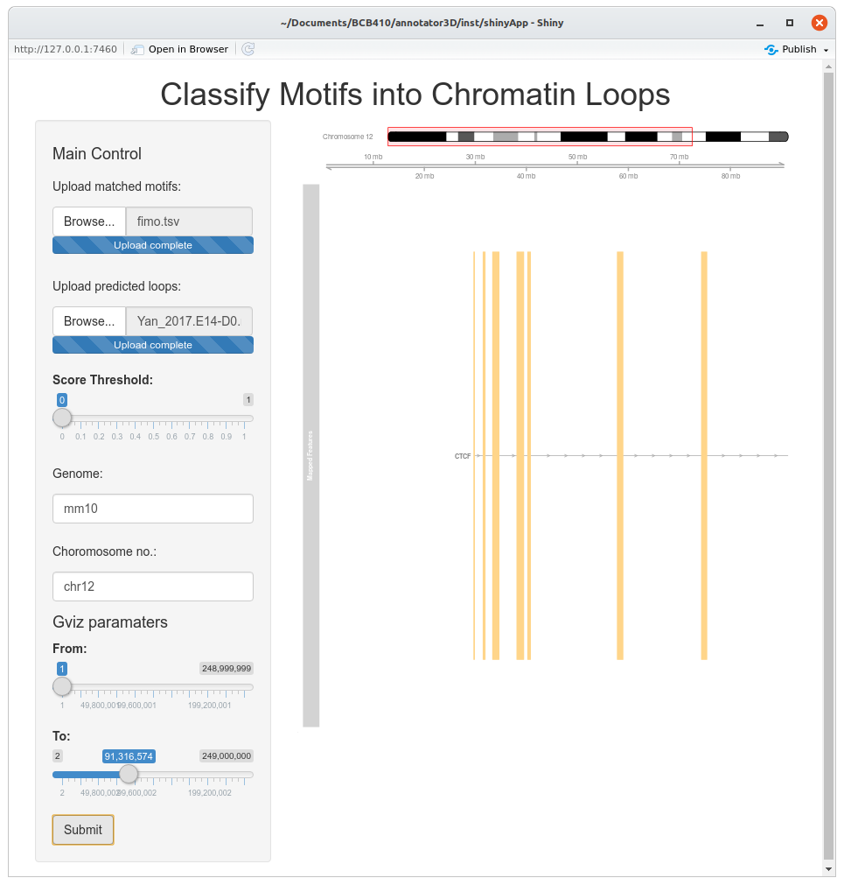

# Three-dimensional Annotation of Motifs into Topologically-associating Domains

<!-- badges: start -->
<!-- badges: end -->

Three-dimensional organization of the chromosome is a factor of gene expression regulation. Visualizations of 3D information is often presented separately from genome/epigenome features and motifs. One existing approach to integrate topological information is simply layering the chromatin loops using **Gviz**. While powerful tools to correlate several annotation features, there is no current function to highlight the membership of features and motifs to chromatin loops using **Gviz**.

The goal of **annotator3D** is to annotate motifs into hierarchical chromatin loops. **annotator3D** does so by:
1. Soft-classifying motifs into chromatin loops by positions (functions found in `classification.R`);
2. Extending **Gviz** with a classifiedAnnotation class to highlight loop membership (work in progress)

## Installation

You first need the following environment:
* **R (>= 3.5.0)**
* [**Gviz 1.30.0**](https://bioconductor.org/packages/release/bioc/html/Gviz.html) from Bioconductor.

You can now install **annotator3D 0.1.0** with:

``` r
require(devtools)
devtools::install_github("NElnour/annotator3D", build_vignettes = TRUE)
library(annotator3D)
```


### Example

This is a basic example which shows you how to classify motifs into chromatin loops:

``` r
data("A549ChromLoops")
data("matchedMotifs"")

classify(matchedMotifs, A549ChromLoops)
```
The call to `classify` creates a local directory, **BEDs**, where it stores a BED file for each motif.

To visualize the classification as a **Gviz** track,

``` r
gen <- c("mm10")
names(gen) <- "chr18"
antrack <- classifiedAnnotationTrack(motifs.cl, gen)

plotTracks(antrack)
```


## Overview
For a more detailed example, see the package's vignette.

```r
browseVignettes("annotator3D")
```


The functions within **annotator3D** include:
1. `classifiedAnnotationTrack`
    * `filter_motifs`
2. `classify`
    * `bin_motifs`
    * `calculate_overflow`
3. `plot_layered_gviz`
4. `runAnnotator`
    
Function `classify` relies on `bin_motifs` and `calculate_overflow` to calculate a soft classification score of motifs into the chromatin loops by position. It outputs a list of motifs the chromatin loops/sub-chromatin loops for which their scores are non-zero.

Function `classifiedAnnotationTrack` returns a **Gviz** annotation track that contains classification information and can be inserted into track plots. It uses the helper function `filter_motifs` to select motifs with membership scores bounded below by a user-set threshold. A layered **Gviz** image containing an ideogram, the classified annotations, and a linear gene track can be obtained with 
`plot_layered_gviz`.

Finally, function `runAnnotator` launches a Shiny app. It was built by following [RStudio's Shiny tutorial](https://shiny.rstudio.com/tutorial/). The Shiny app allows the user to easily explore different significance threshold levels and see the updated effect on the layered Gviz plot. The user can also zoom into and out of a range by mainpulating the ranges' sliders.



This package also contains two datasets:
1. **matchedMotifs**: Matched motif output by FIMO after scanning above chromsome 18 with 369 mouse motifs recently reported to regulate histone modification [Dataset_S01](https://www.pnas.org/content/116/9/3668/tab-figures-data) (Ngo *et al.*, 2019).
2. **A549ChromLoops**: Predicted chromatin loops in chromosome 18 of A549 cells. (Salameh, *et al.*, 2019)

## Contributions
The author of this package is Nada Elnour. 

## References

Ngo V, Chen Z, Zhang K, Whitaker J, Wang M, Wang W. (2019) Epigenomic analysis reveals DNA motifs regulating histone modifications in human and mouse. *PNAS* **116**(9): 3668--3677.

Salameh TJ,  Wang X, Song F, Zhang B, Wright SM, Khunsriraksakul C, Yue F. A supervised learning framework for chromatin loop detection in genome-wide contact maps. biorXiv. doi: https://doi.org/10.1101/739698.
